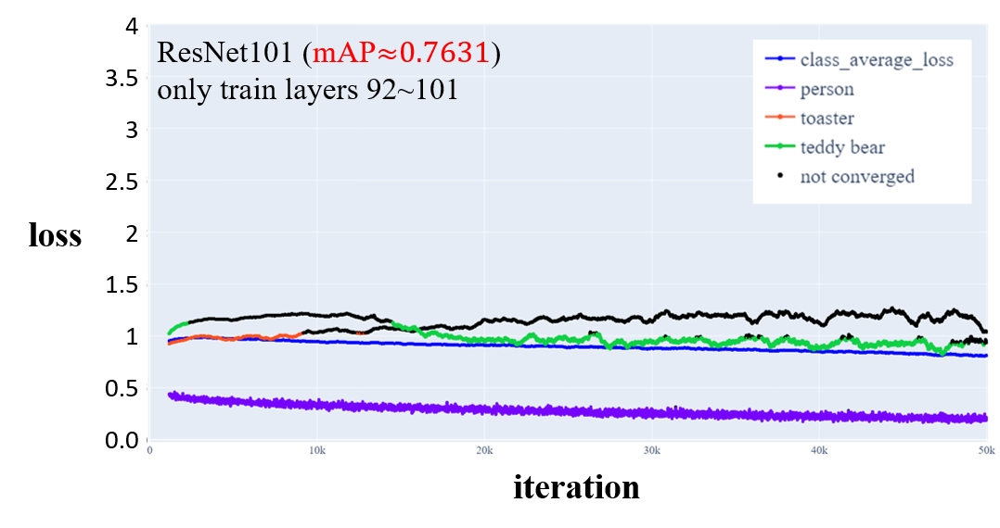
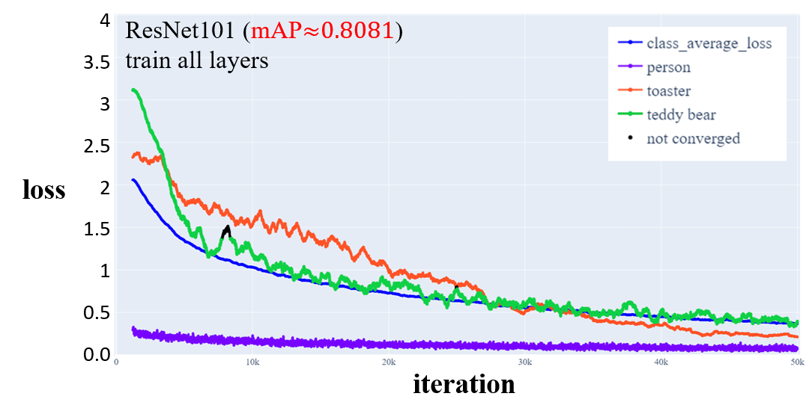

## Early-stopping5
Early-stopping, through the use of subcategories from a user-defined dataset, detects the convergence status of each subcategory and effectively assists users in identifying potential issues during deep learning training.

## Table of contents
- [MNIST (Imbalanced)](#MNIST (Imbalanced))
- [COCO]()

## MNIST (Imbalanced)
<details>
<summary>MNIST</summary>

|Digit|number of samples (Origin)|number of samples (Imbalanced)|
|:------:|:------:|:------:|
|0|5923|5000|
|1|6742|4500|
|2|5958|4000|
|3|6131|3500|
|4|5842|3000|
|5|5421|2500|
|6|5918|2000|
|7|6265|1500|
|8|5851|1000|
|9|5949|500|

### code
```python
early_stopping = EarlyStopping(100, ['zero', 'one', 'two', 'three', 'four', 'five', 'six', 'seven', 'eight', 'nine'], deno=50, warmup=50)
digitToEng = dict()
digitToEng['0'] = 'zero'
digitToEng['1'] = 'one'
digitToEng['2'] = 'two'
digitToEng['3'] = 'three'
digitToEng['4'] = 'four'
digitToEng['5'] = 'five'
digitToEng['6'] = 'six'
digitToEng['7'] = 'seven'
digitToEng['8'] = 'eight'
digitToEng['9'] = 'nine'

criterion = nn.BCEWithLogitsLoss(reduction="none")

for i in range(max_epoch):
    for i_batch, (inputs, labels) in enumerate(train_dataloader):

        outputs = model(inputs)
        loss = criterion(outputs, labels) # output shape: BxC

        subclass_loss = collections.defaultdict(list)

        for i in range(outputs.shape[0]):
            b = labels.detach()[i,:].cpu().numpy() > 0
            indices = list(b.nonzero()[0])
            subclass_loss[digitToEng[str(indices[0])]].append(torch.mean(loss[i,:]))
        loss = torch.mean(loss)
        early_stopping(subclass_loss, loss.item(), model)
        if early_stopping.early_stop:
            break
    if early_stopping.early_stop:
        break        
```

### result


</details>

## COCO 
<details>
<summary>COCO</summary>

### code
```python
#=======read classes from .txt======
my_file = open("temp/coco/label.txt", "r")
data = my_file.read()
classes = data.split("\n")[:-1]
my_file.close()
#===================================

self.early_stopping = EarlyStopping(5000, ['iter_loss']+classes, deno=500, max_iter=100000, fixed_threshold=True, sub_beta=0.2, path='')

for i in range(max_epoch):
    for _, batch in enumerate(self.train_loader):
        x, y = batch[0].cuda(), batch[1].cuda()
        pred_y = self.model(x)
        loss = self.criterion(pred_y, y)

        #=============analyzing target subclasses===========
        subclass = collections.defaultdict(list)
        for i in range(loss.shape[0]):
            b = y.detach()[i,:].cpu().numpy() > 0
            indices = list(b.nonzero()[0])
            for idx in indices:
                subclass_loss = loss.detach()[i,idx].item()
                subclass[classes[idx]].append(subclass_loss)
        loss = torch.mean(loss)
        subclass['iter_loss'].append(loss.detach().item())
        self.early_stopping(subclass, loss.item(), self.model)
        #===================================================

        self.optimizer.zero_grad()
        loss.backward()
        self.optimizer.step()
        if self.global_step % 400 == 0:
            self.writer.add_scalar('Loss/train', loss, self.global_step)
            print('TRAIN [epoch {}] loss: {:4f}'.format(epoch, loss))

        self.global_step += 1
        if self.early_stopping.early_stop:
            break
    if self.early_stopping.early_stop:
        torch.save(self.model.state_dict(), 'last_model.pth')
        break
```

### result


</details>