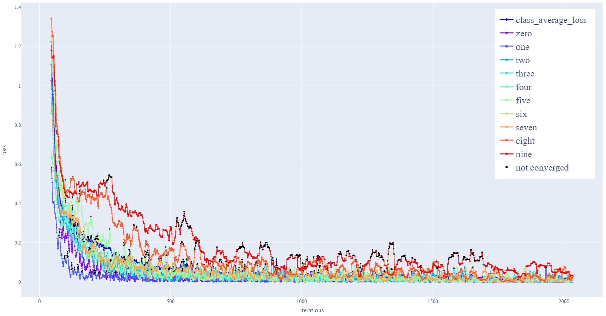
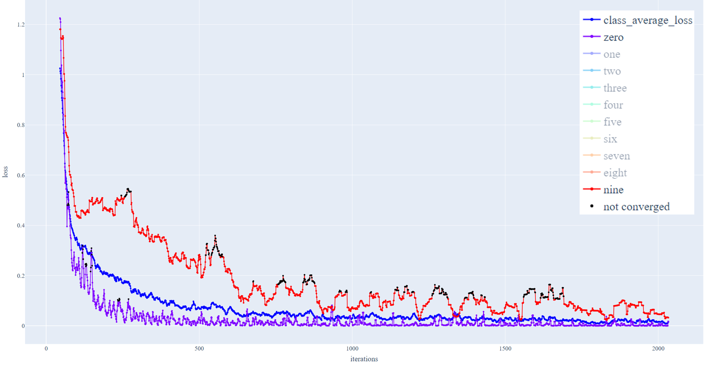

# Early-stopping5

## MNIST (Imbalanced)
<details>
<summary>MNIST</summary>

|Digit|number of samples (Origin)|number of samples (Imbalanced)|
|:------:|:------:|:------:|
|0|5923|5000|
|1|6742|4500|
|2|5958|4000|
|3|6131|3500|
|4|5842|3000|
|5|5421|2500|
|6|5918|2000|
|7|6265|1500|
|8|5851|1000|
|9|5949|500|

### code
```python
early_stopping = EarlyStopping(100, ['zero', 'one', 'two', 'three', 'four', 'five', 'six', 'seven', 'eight', 'nine'], deno=100, warmup=50)
digitToEng = dict()
digitToEng['0'] = 'zero'
digitToEng['1'] = 'one'
digitToEng['2'] = 'two'
digitToEng['3'] = 'three'
digitToEng['4'] = 'four'
digitToEng['5'] = 'five'
digitToEng['6'] = 'six'
digitToEng['7'] = 'seven'
digitToEng['8'] = 'eight'
digitToEng['9'] = 'nine'

criterion = nn.BCEWithLogitsLoss(reduction="none")

for i_batch, (inputs, labels) in enumerate(train_dataloader):

    outputs = model(inputs)
    loss = criterion(outputs, labels) # output shape: BxC

    subclass_loss = collections.defaultdict(list)

    for i in range(outputs.shape[0]):
        b = labels.detach()[i,:].cpu().numpy() > 0
        indices = list(b.nonzero()[0])
        subclass_loss[digitToEng[str(indices[0])]].append(torch.mean(loss[i,:]))
    loss = torch.mean(loss)
    early_stopping(subclass_loss, loss.item(), model)
```

### result



</details>